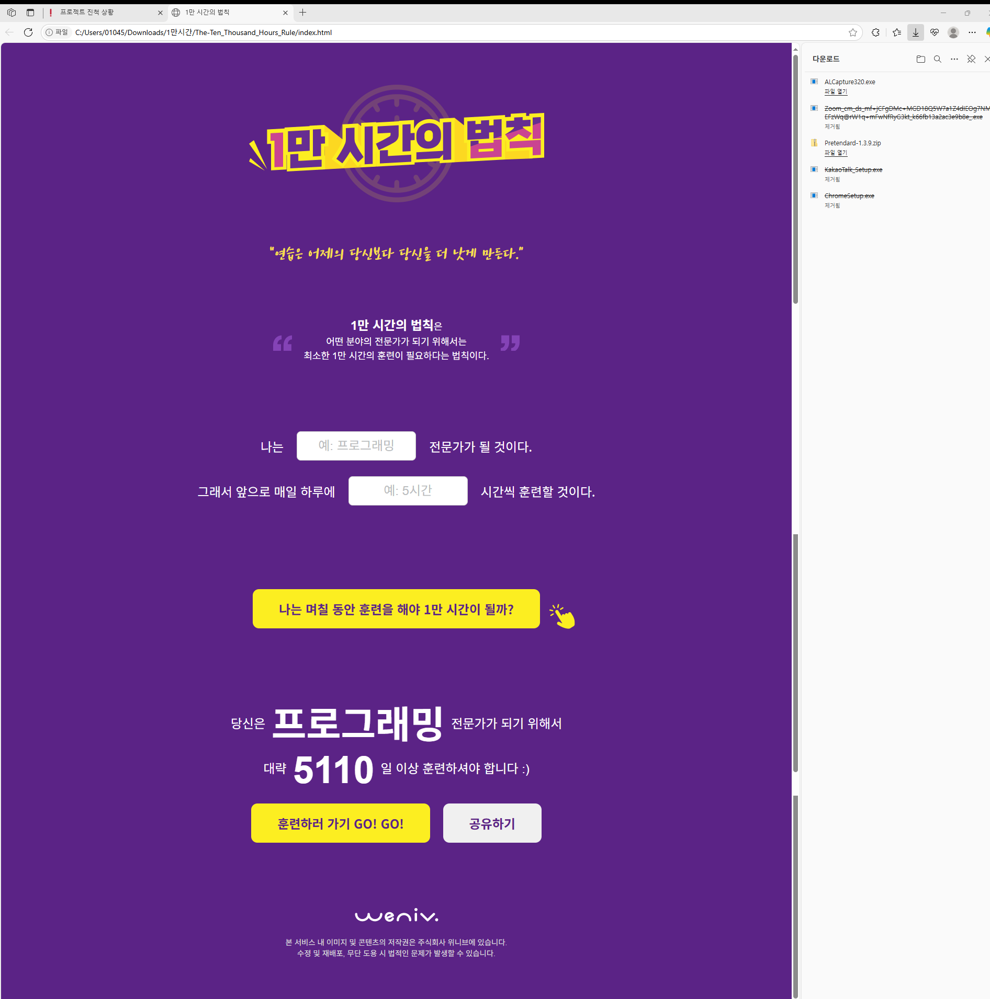
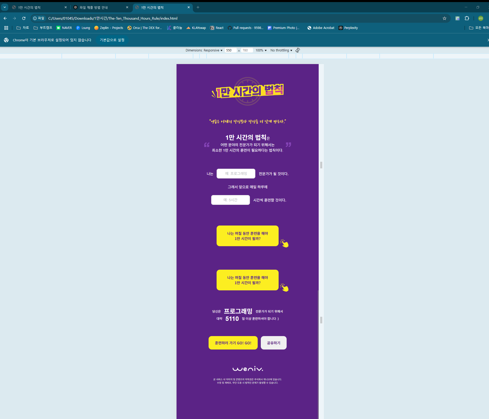

# 1만 시간의 법칙 프로젝트

**"연습은 어제의 당신보다 당신을 더 낫게 만든다."**

**1만 시간의 법칙**은 어떤 분야의 전문가가 되기 위해서는 최소한 1만 시간의 훈련이 필요하다는 법칙을 기반으로 한 **웹 애플리케이션**입니다.

---

## 🖼️ 구현 화면

### 💻 PC 화면


### 📱 모바일 화면


---

##  사용 기술 스택

- **HTML5**
- **CSS3 (Media Query 기반 반응형 스타일링)**
- **Vanilla JavaScript** (DOM 제어 및 이벤트 처리)

---

##  실행 방법

1. 이 저장소를 클론하거나 ZIP 파일로 다운로드
2. `index.html` 파일을 브라우저에서 열면 실행 완료!
3. 또는 아래 링크에서 바로 확인:  
🔗 [배포 링크](https://lsung506.github.io/The-Ten_Thousand_Hours_Rule/)

---

##  반응형 구성

- `@media (max-width: 768px)` 기준으로 모바일 전환
- 모바일 환경에서는 입력 폼, 버튼, 글꼴 크기 등을 최적화하여 표시

---

##  팝업 기능

- `btn` 클릭 시 `.popup`이 화면 중앙에 표시 (`display: block`)
- 팝업 내부의 `a.closePopup` 클릭 시 닫힘 (`display: none`)

---

##  시멘틱 HTML 구조

```html
<body>
  <header>...</header>
  <main>
    <section class="description">...</section>
    <section class="form-area">...</section>
    <section class="textBox">...</section>
    <section class="result">...</section>
  </main>
  <footer>...</footer>
  <div class="popup">...</div>
</body>
